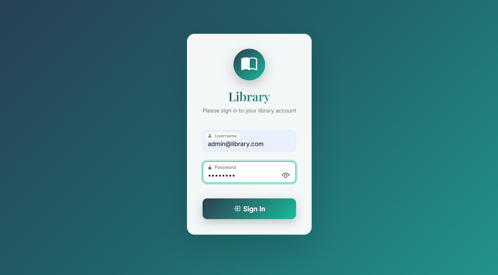
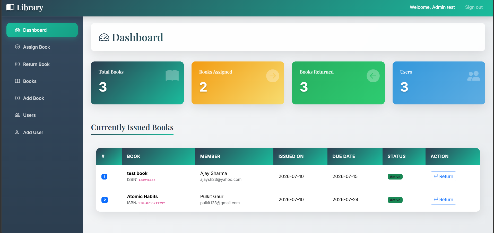
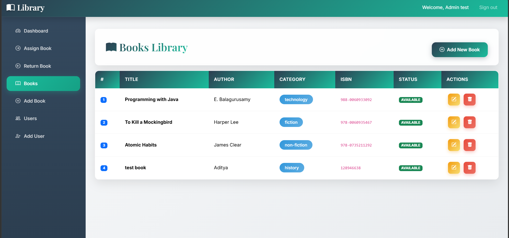
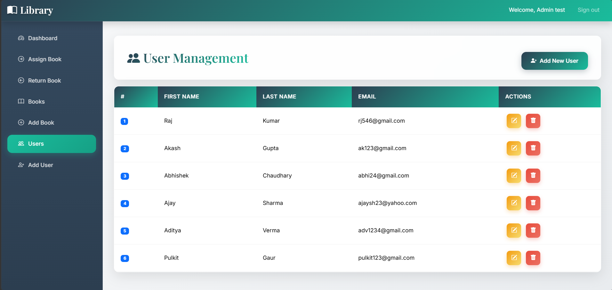
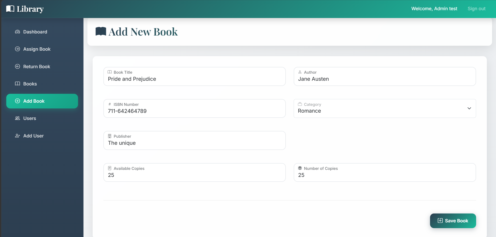
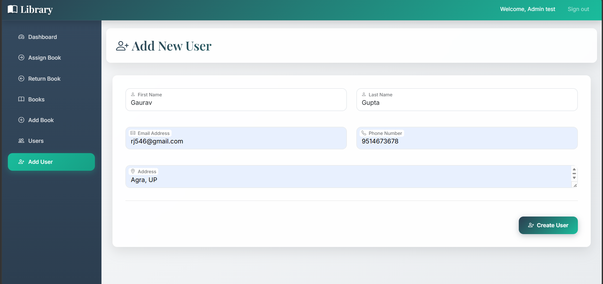
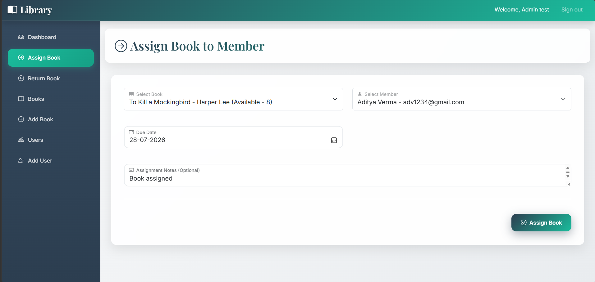
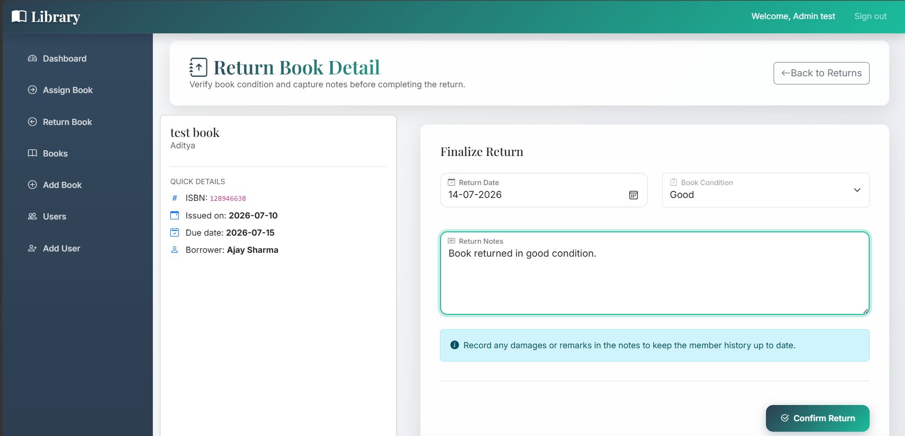

# 📚 Library Management System

<p align="center">


</p>

<p align="center">
A full-stack enterprise web application built using <b>Java, Jakarta Servlet, JSP, Servlets, JDBC, MySQL and Bootstrap</b> to automate library operations including book management, member registration and transaction tracking.
</p>

---

## 📖 About

This project demonstrates my understanding of Java web application development using MVC architecture, Servlets, JSP, JDBC and MySQL. It provides a complete solution for managing books, users and book transactions through a responsive and user-friendly interface.

---

## 🎥 Demo

https://github.com/user-attachments/assets/f80c612f-2d38-4a91-8b5d-360714f8ff6f
---

## 🚀 Features

### 📊 Dashboard

- View total books
- Monitor registered users
- Track issued books
- View returned books
- Interactive statistics cards

### 📚 Book Management

- Add new books
- View available inventory
- Maintain complete catalog
- Store author and publication details

### 👤 Member Management

- Register new members
- Client-side form validation
- Store complete member information
- Prevent invalid submissions

### 🔄 Book Transactions

- Issue books
- Return books
- Automatic due date calculation
- Transaction tracking

### 📅 Status Tracking

- Active
- Due Today
- Overdue

### 🔒 Security & Reliability

- Authentication Filters
- JDBC Prepared Statements
- Null-safe Validation
- Transaction Handling
- MVC Architecture
- DAO Pattern

---

## 🛠 Tech Stack

| Category | Technologies |
|----------|--------------|
| Language | Java 17 |
| Backend | Jakarta Servlet 6.1, JSP, JSTL |
| Frontend | HTML5, CSS3, JavaScript (ES6), Bootstrap 5.3.2 |
| Database | MySQL, JDBC (MySQL Connector/J 9.0.0) |
| Architecture | MVC + DAO |
| Build Tool | Maven |
| Server | Apache Tomcat 11 |

---

## 📸 Screenshots

<table>

<tr>
<td align="center"><b>Login</b></td>
<td align="center"><b>Dashboard</b></td>
</tr>

<tr>
<td>

</td>

<td>

</td>
</tr>

<tr>
<td align="center"><b>Books</b></td>
<td align="center"><b>Users</b></td>
</tr>

<tr>
<td>

</td>

<td>

</td>
</tr>

<tr>
<td align="center"><b>Add Book</b></td>
<td align="center"><b>Add User</b></td>
</tr>

<tr>
<td>

</td>

<td>

</td>
</tr>

<tr>
<td align="center"><b>Assign Book</b></td>
<td align="center"><b>Return Book</b></td>
</tr>

<tr>
<td>

</td>

<td>

</td>
</tr>

</table>

---

## 📋 Prerequisites

Before running the project, ensure the following software is installed:

- Java JDK 17 or higher
- Apache Maven
- Apache Tomcat 11
- MySQL Server 8.0 or higher
- MySQL Workbench *(optional, for database management)*

---

## 📂 Project Structure

```text
Library-Management-System
│
├── database/
│   └── db.sql
│
├── libraryapp/
│   ├── src/main/
│   │   ├── java/com/lms/
│   │   │   ├── controller/
│   │   │   ├── dao/
│   │   │   ├── daoImpl/
│   │   │   ├── filter/
│   │   │   ├── pojo/
│   │   │   ├── service/
│   │   │   ├── serviceImpl/
│   │   │   └── util/
│   │   │
│   │   └── webapp/
│   │       ├── assets/
│   │       ├── jsp/
│   │       └── WEB-INF/
│   │
│   ├── pom.xml
│   └── target/
│
└── README.md
```

---

## ⚙️ Installation

### 1. Clone Repository

```bash
git clone https://github.com/pulkitgaur16/Library-Management-System.git

cd Library-Management-System
```

---

### 2. Create Database

Create a MySQL database.

```sql
CREATE DATABASE library_db;
```

Execute

```
database/db.sql
```

to create all required tables.

---

### 3. Configure Database

Update your JDBC connection details inside your database utility class.

```java
URL = jdbc:mysql://localhost:3306/library_db

Username = your_username

Password = your_password
```

---

### 4. Build Project

```bash
mvn clean package
```

The build generates a WAR file inside:

```
target/
```

---

### 5. Deploy

Copy the generated WAR file into:

```
Tomcat/webapps/
```

Start Apache Tomcat.

Open:

```
http://localhost:8080/libraryapp
```

---

## 🔑 Demo Credentials

Use the following administrator account after completing the setup.

| Field | Value |
|------|------|
| **Username** | `admin@library.com` |
| **Password** | `admin123` |

> **Note:** This application currently supports a single administrator account for managing library operations. Additional authentication and role-based access can be implemented in future enhancements.

---

## 🚀 Future Enhancements

- Secure Admin Authentication
- Advanced Search & Filtering
- Email Notifications
- Fine Calculation for Late Returns
- REST API Integration

---

## 🧠 Concepts Used

- MVC Architecture
- DAO Pattern
- Object-Oriented Programming
- JDBC
- Servlets
- JSP
- JSTL
- HTTP Filters
- Prepared Statements
- Exception Handling
- Form Validation

---

## 📈 Project Highlights

- ✅ Enterprise-style MVC Architecture
- ✅ Responsive Bootstrap UI
- ✅ Secure JDBC Database Operations
- ✅ Authentication using Servlet Filters
- ✅ DAO-based Data Access Layer
- ✅ Maven Build Management
- ✅ Clean and Modular Project Structure
- ✅ CRUD Operations for Books and Users
- ✅ Book Issue & Return Workflow
- ✅ MySQL Database Integration

